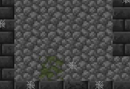

## Przedmiot: Programowanie w języku python

# Projekt - gra "Dungeon Adventure"

## Autorzy
- Błażej Kapkowski
- Konrad Tendaj

## Uruchomienie gry

Potrzebne biblioteki:  
- pygame (v.2.5.2) 
- matplotlib (v.3.8.3) 
- pillow (v.10.2.0)

Zasoby graficzne znajdują się pod tym linkiem:  
https://aghedupl-my.sharepoint.com/:u:/g/personal/konradtendaj_student_agh_edu_pl/ES8qShdyc7ZKjl3MPc9TsasBIre1y0h-fZtGMP21_aS73Q?e=kzO9eH  
Po ich pobraniu, należy rozpakować skompresowany folder oraz umieścić cały folder resources w folderze game.

## Opis projektu
"Dungeon Adventure" to prosta gra Roguelike typu Dungeon Crawler,
 w której gracz porusza się po losowo wygenerowanych pomieszczeniach labiryntu z losowym jego ułożeniem,
zbiera przedmioty, walczy z przeciwnikami i próbuje dotrzeć do wyjścia, którego chroni boss.
Gra jest stworzona w języku Python z wykorzystaniem biblioteki Pygame.

**Przykładowe zrzuty ekranu z gry:**

Różnorodni przeciwnicy:  

Ataki:  

Przedmioty:  
  

  

  

Interfejs i ekwipunek:  

Boss:  

Statystyki na koniec gry:  

